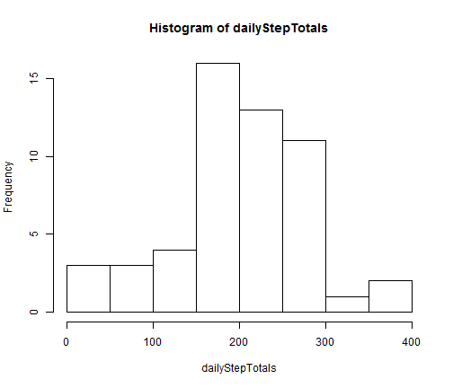
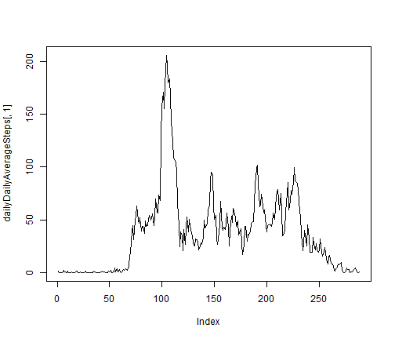
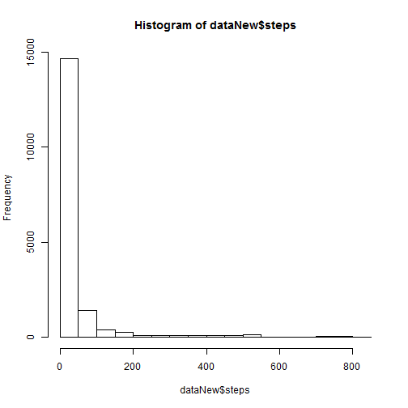
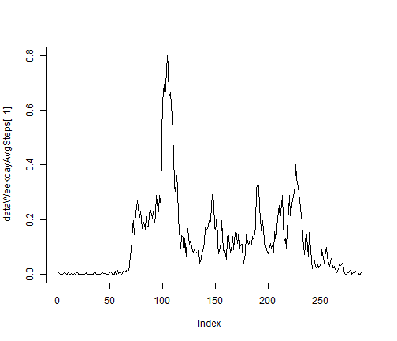
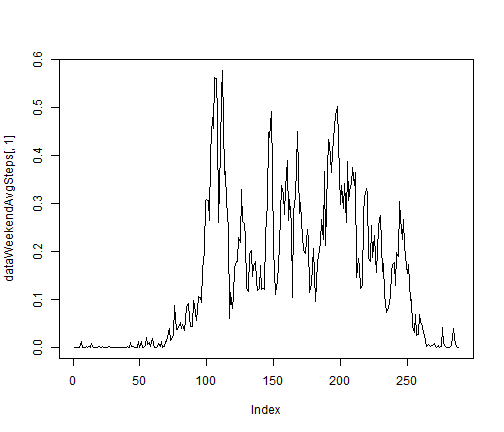

# Reproducible Research: Peer Assessment 1


## Loading and preprocessing the data

```r
 filepath <- "./activity/activity.csv"
 data <- read.csv(filepath)
 dataHavingStepValues <- data[!is.na(data$steps),] # Remove rows with NA in steps
```

## What is mean total number of steps taken per day?

```r
 dates <- unique(dataHavingStepValues$date)
 numberOfDates <- length(dates)
 computeAverage <- function(x){
   sum(x)/numberOfDates
 }
 dailyStepTotals <- by(dataHavingStepValues$steps, dataHavingStepValues$date, computeAverage)
```

```r
 hist(dailyStepTotals,breaks=10)
```

 

```r
  meanSteps <- mean(as.numeric(dailyStepTotals), na.rm = TRUE)
  medianSteps <- median(as.numeric(dailyStepTotals), na.rm = TRUE)
```
### The mean total number of steps taken per day is 203.1356
## What is the average daily activity pattern?

```r
  dailyDailyAverageSteps <- data.frame(do.call("rbind",as.list(by(dataHavingStepValues$steps, dataHavingStepValues$interval, computeAverage))))
```


```r
 plot(dailyDailyAverageSteps[,1],type="l")
```

 

```r
 colnames(dailyDailyAverageSteps) <- c("AverageSteps")
 indexOfMax <- which.max(dailyDailyAverageSteps$AverageSteps) 
 maxSteps <- dailyDailyAverageSteps[indexOfMax,]
 timeAtMax <- rownames(dailyDailyAverageSteps)[indexOfMax]
```
### The maximum number of steps within a 5 min interval is 206.1698 and it occurs at 835 .

## Imputing missing values

```r
 numNAs <- dim(data[is.na(data$steps),])[1]
```
### The number of days having "NA" for steps values is `r numNAs'.


```r
  dataNew <- data
  for(i in 1:dim(dataNew)[1]){
    if(is.na(dataNew[i,]$steps)){
      interval <- dataNew[i,]$interval
      avgSteps <- dailyDailyAverageSteps[as.character(interval),]
      dataNew[i,]$steps <- as.numeric(avgSteps)
    }
  }
  hist(dataNew$steps)
```

 

```r
  meanSteps <- mean(dataNew$steps)
```

The mean number of steps 37.3826


## Are there differences in activity patterns between weekdays and weekends?

```r
  dataNew$weekday <- ifelse( weekdays(as.Date(dataNew$date)) == "Saturday" | weekdays(as.Date(dataNew$date)) == "Sunday","weekend","weekday" )

  dataWeekday <- dataNew[dataNew$weekday == "weekday",]
  dataWeekend <- dataNew[dataNew$weekday == "weekend",]

  numberOfWeekdays <- dim(dataWeekday)[1]
  numberOfWeekends <- dim(dataWeekend)[1]
  computeAverageWeekdays <- function(x){
    sum(x)/numberOfWeekdays
  }
  computeAverageWeekends <- function(x){
    sum(x)/numberOfWeekends
  }

  dataWeekdayAvgSteps <- data.frame(do.call("rbind",as.list(by(dataWeekday$steps, dataWeekday$interval, computeAverageWeekdays))))
  dataWeekendAvgSteps <- data.frame(do.call("rbind",as.list(by(dataWeekend$steps, dataWeekend$interval, computeAverageWeekends))))
```

```r
  plot(dataWeekdayAvgSteps[,1],type="l")
```

 

```r
  plot(dataWeekendAvgSteps[,1],type="l")
```

 


